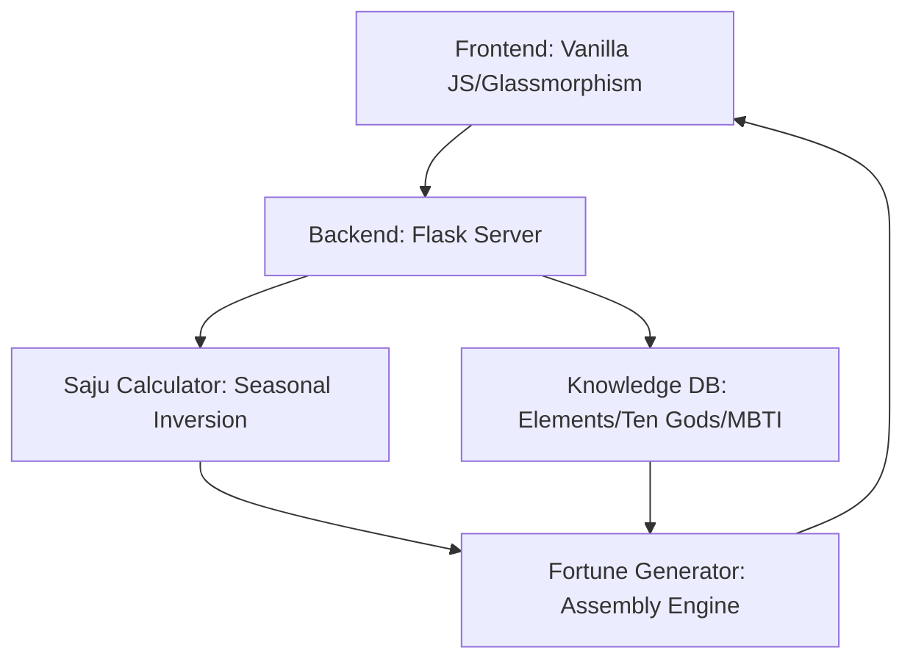

# 🔮 Fate Navigator: Saju AI Expert Engine (v1.0)

**Fate Navigator** is a high-precision, data-driven Saju (Traditional Korean Fortune Telling) application. Unlike LLM-only solutions, this app combines sub-millisecond traditional calculations with a deep knowledge database to provide context-aware, "Expert-grade" interpretations.

## 🚀 Key Features

- **Traditional Saju Engine**: Pure DB-based logic (No AI hallucination) for core readings.
- **Southern Hemisphere Support**: Automatic seasonal inversion for accurate readings globally.
- **Saju-MBTI Hybrid**: Cross-analyzes traditional "Ten Gods" (십성) personality with modern MBTI types for unique insights.
- **Context-Aware Analysis**: Dynamic theme switching (나만 보기, 연인/썸, 직장/비즈니스) with strictly gated content.
- **Secret Code Monetization**: Built-in relationship "Secret Code" mechanism for premium insights.
- **Progressive Web App (PWA)**: Installable on mobile with offline-first caching strategy.
- **MZ-Premium UI**: Modern Glassmorphism aesthetic with high-density relationship visualizations.

## 🏗️ Architecture



- **`backend/app_flask.py`**: Entry point for API requests (Port 8080).
- **`backend/fortune_generator.py`**: The "Expert Engine" that assembles 6000+ characters of content based on profile data.
- **`backend/saju_calculator.py`**: Precise Saju math including Southern Hemisphere logic.
- **`backend/saju_db.py`**: Knowledge Base containing interpretation blocks for all 16 MBTI types and 10 Heavenly Stems.
- **`frontend/index.html`**: Zero-dependency SPA with premium CSS and PWA features.

## 🛠️ Setup & Execution

### 1. Requirements
- Python 3.9+
- Flask, Flask-CORS

### 2. Quick Start
```bash
# Install dependencies
pip install -r backend/requirements.txt

# Run the server
python backend/app_flask.py
```
*Access the app at `http://localhost:8080`*

## 🧪 Testing & Verification

This project is built for **AI-Ready testing**. The frontend exposes several WebMCP tools and diagnostic functions:
- **`analyzeSaju` API**: Programmatic access to the full analysis engine.
- **`test_all_features`**: Internal diagnostic suite for UI consistency.

To run automated tests with Playwright/Chrome-DevTools:
1. Ensure the server is running.
2. Navigate to `http://localhost:8080`.
3. Use the developer console or an agentic tool to trigger analysis flows.

---
**Author**: Antigravity (Advanced Agentic AI)
**Permanent Repo**: [charles69729798/saju-ai-app-final](https://github.com/charles69729798/saju-ai-app-final)
